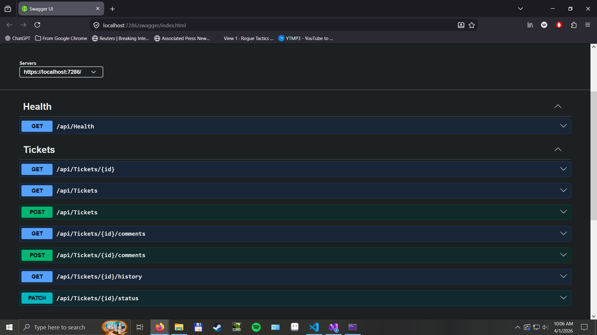

# ASP.NET Core Support Ticket API

A backend portfolio project built with C# and ASP.NET Core Web API to model a simple support and issue-tracking workflow.

## Purpose

This project is designed to demonstrate practical backend development skills in a way that supports:

- remote .NET / C# job applications
- maintenance, support, and internal-tools oriented software roles
- future freelance work involving ASP.NET Core bug fixing, debugging, and API improvement

## Project Concept

The API models a lightweight support-ticket workflow with:

- tickets
- comments
- users
- status history

The project is intentionally scoped around **support and maintenance workflows** rather than flashy greenfield features. The goal is to demonstrate practical API design, relational data modeling, maintainability, and testing in a format that is easy to evaluate as a portfolio asset.

## Current Features

Implemented features currently include:

- create a ticket
- retrieve a ticket by ID
- list tickets
- filter tickets by status, priority, creator, and assignee
- update ticket status
- automatically record status history entries when status changes
- create comments for a ticket
- retrieve comments for a ticket
- retrieve status history for a ticket
- standardized input validation and normalization for ticket, comment, priority, and status data

## API Overview

Swagger UI showing the current implemented endpoint surface:



## API Endpoints

### Health
- `GET /api/health`

### Tickets
- `POST /api/tickets`
- `GET /api/tickets`
- `GET /api/tickets/{id}`
- `PATCH /api/tickets/{id}/status`

### Comments
- `POST /api/tickets/{id}/comments`
- `GET /api/tickets/{id}/comments`

### Status History
- `GET /api/tickets/{id}/history`

### Supported Filters for `GET /api/tickets`
- `status`
- `priority`
- `createdByUserId`
- `assignedToUserId`

## Example Requests

### Create Ticket

`POST /api/tickets`

```json
{
  "title": "Customer cannot access billing page",
  "description": "Billing page returns an error for one tenant.",
  "priority": "High",
  "createdByUserId": 1,
  "assignedToUserId": 2
}
```

### Update Ticket Status

`PATCH /api/tickets/{id}/status`

```json
{
  "status": "Resolved"
}
```

### Create Comment

`POST /api/tickets/{id}/comments`

```json
{
  "authorUserId": 2,
  "body": "Issue reproduced and fix has been verified in staging."
}
```

## Core Entities

### Ticket
- Id
- Title
- Description
- Priority
- Status
- CreatedAt
- UpdatedAt
- CreatedByUserId
- AssignedToUserId

### Comment
- Id
- TicketId
- AuthorUserId
- Body
- CreatedAt

### AppUser
- Id
- Name
- Email

### StatusHistory
- Id
- TicketId
- OldStatus
- NewStatus
- ChangedAt

## Tech Stack

- .NET 10
- ASP.NET Core Web API
- Entity Framework Core
- SQL Server LocalDB
- OpenAPI
- Swagger UI
- xUnit
- SQLite (in-memory, for integration tests)

## Testing

The project includes integration tests for key API workflows using xUnit and ASP.NET Core integration testing infrastructure.

Current automated coverage includes:

- health endpoint smoke test
- ticket creation workflow
- status update with history verification
- comment creation and retrieval workflow

Tests run against a **separate SQLite in-memory database**, so they do not write to the main development database.

## Conventions and Notes

For additional details on route style, validation rules, status and priority normalization, and general API behavior conventions, see:

- [API Conventions](./notes/ApiConventions.md)

## Local Setup

### Prerequisites
- .NET 10 SDK
- SQL Server LocalDB
- Visual Studio or another compatible .NET development environment

### Run the application
1. Restore NuGet packages
2. Apply the database migration
3. Run the API project
4. Open Swagger UI in the browser

### Database
The main application uses SQL Server LocalDB for development.

### Test database
The integration tests use a separate SQLite in-memory database configured specifically for the test host.

## Current Status

The project is currently in active development and already includes a usable core workflow for tickets, comments, and status tracking.

At this stage, the project demonstrates:

- practical CRUD and workflow-oriented API development
- relational modeling with EF Core
- support/maintenance-oriented feature design
- consistent validation and normalization
- integration testing of real API workflows
- separation between development and test database environments

## Why This Project Matters

This project is intentionally designed to be more than a basic CRUD demo.

It is meant to show the kind of work commonly involved in real support and maintenance-oriented backend roles:

- extending existing application behavior
- tracking workflow state changes
- preserving audit-style history
- validating and normalizing input consistently
- testing behavior through real API requests instead of only isolated methods

That makes it relevant both for traditional .NET/backend roles and for freelance work involving debugging, maintenance, and incremental API improvements.

## Possible Next Improvements

Some natural next steps for the project include:

- service layer extraction
- pagination for ticket lists
- richer history/audit metadata
- additional integration test coverage
- Docker support
- authentication / authorization